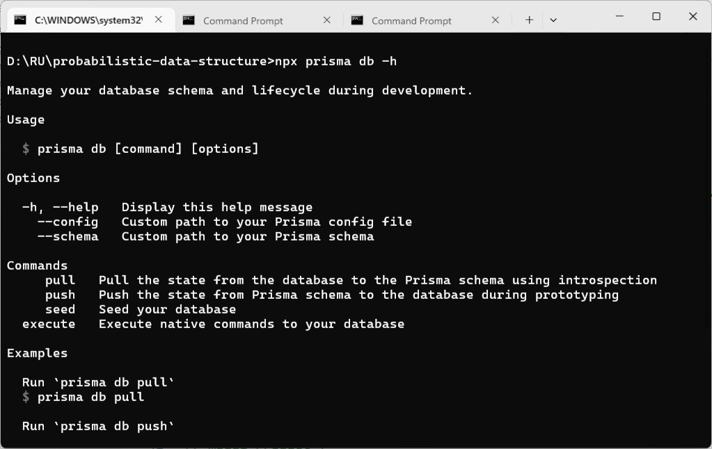
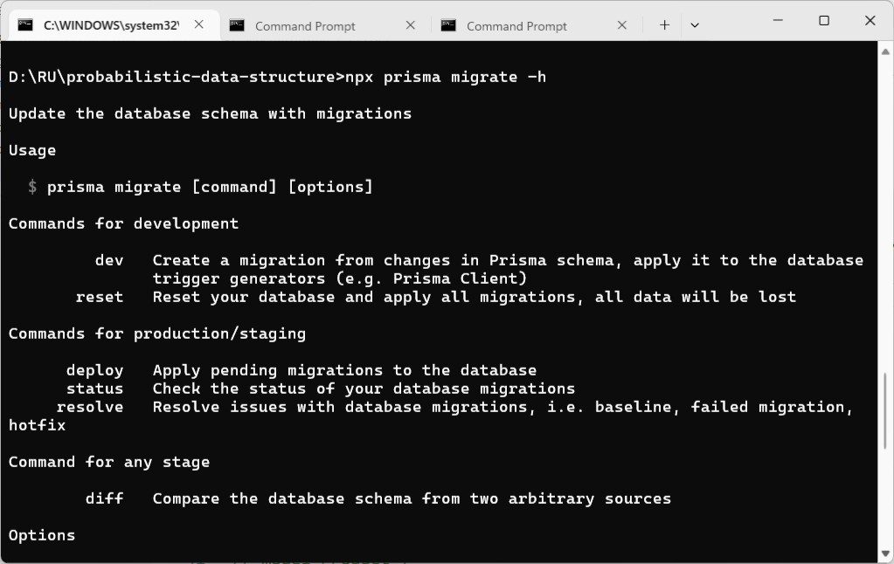
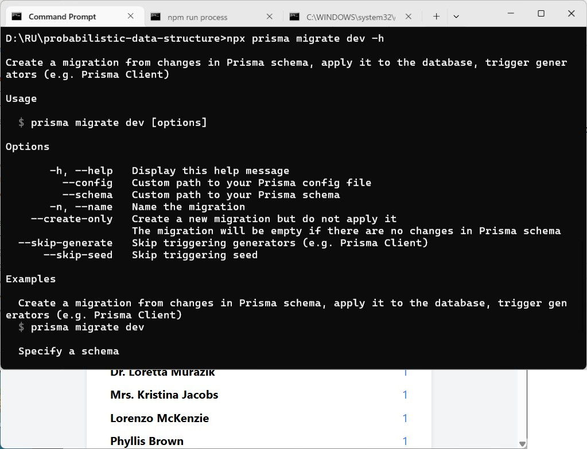
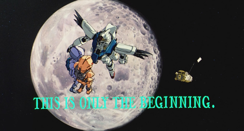

### Probabilistic Data Structure (Part 3/3)
> "I am certainly ignorant, but facts are facts, which is very sad for me but also advantageous, since an ignorant man will dare to do more, so I will happily go about in my ignorance with what I am sure are its unfortunate consequences for a little longer, as long as my strength allows."<br />The Castle by Franz Kafka


#### Prologue
Redis is a memory-first, NoSQL database. Once processed, there's no point to keep our ever-growing stream in RAM anymore. To complete with our ecosystem, we are going to persist stream data to disk, I mean to save them to MariaDB. 


#### I. System Design  
To begin with: 
```
npm install prisma --save-dev
npx prisma init
```

RDBMS can not do without schema. Let's define User model in  `prisma/schema.js`:
```
datasource db {
  provider = "mysql"
  url      = env("DATABASE_URL")
}

// "male", "female", or "unknown"
enum Gender {
  male    @map("male")
  female  @map("female")
  unknown @map("unknown")
}

model User {
  id        String   @id @default(uuid()) // Unique user ID
  fullname  String
  email     String   @unique
  birthdate BigInt   @default(19000101) // Stored in YYYYMMDD format
  gender    Gender
  phone     String
  createdAt DateTime @default(now()) // ISO 8601 timestamp

  @@fulltext([fullname])
  @@map("users")
}
```

As I have stated, Prisma is a mature ORM tools which support bi-direction schema evolution: 


The simplest form being: 
- `npx prisma db pull` : Introspection, by retrieving whatever defined in target database and overwrite `schema.js`; 
- `npx prisma db push` : Overwrite target database according to what is defined in `schema.js`;
- `npx prisma db seed` : Seed target database; 

The above commands and one-off and traceless, good for quick and simple case. For more complicated case, you can use `npx prisma migrate` command. 


#### II. Schema Evolution 



To create user table in target database for the first time, we use: with:
```
npx prisma migrate dev --name initial_import
```


#### III. 


#### IV. 


#### V.


#### VI. Bibliography 
1. [Redis Streams](https://redis.io/docs/latest/develop/data-types/streams/)
2. [Prisma](https://www.prisma.io/docs/)
3. []()
4. []()
5. [The Castle by Franz Kafka](https://files.libcom.org/files/Franz%20Kafka-The%20Castle%20(Oxford%20World's%20Classics)%20(2009).pdf)


#### Epilogue
Now, you already armed with both SQL and NoSQL database, but this is just the beginning...




### EOF (2025/05/30)

npm install prisma --save-dev

npx prisma init

npx prisma validate

npx prisma db push

When to Use Redis as a Primary Database - Redis Special Topics (1/4) | System Design
https://youtu.be/BJxtLbE5sxw

Using Redis Streams instead of Kafka - Redis Special Topics (2/4) | System Design
https://youtu.be/zcCEFByssQU

I replaced my Redis cache with Postgres... Here's what happened
https://youtu.be/KWaShWxJzxQ

Count-Min Sketch: An efficient probabilistic Data Structure by Raphael De Lio
https://youtu.be/KRaSkSzwCkE

ClueCon Weekly with Guy Royse [Ep. 31]
https://youtu.be/lIMK2Mi5e40

ClueCon Weekly with Guy Royse pt. 2 [Ep. 34]
https://youtu.be/3o-xcgtf_XU