### Probabilistic Data Structure (Part 3/3)
> "I am certainly ignorant, but facts are facts, which is very sad for me but also advantageous, since an ignorant man will dare to do more, so I will happily go about in my ignorance with what I am sure are its unfortunate consequences for a little longer, as long as my strength allows."<br />The Castle by Franz Kafka


#### Prologue
Redis is a memory-first, NoSQL database. Once processed, there's no point to keep our ever-growing stream in RAM anymore. To complete with our ecosystem, we are going to persist stream data to disk, I mean to save them to MariaDB. 


#### I. System Design  
To begin with: 
```
npm install prisma --save-dev
npx prisma init
```

RDBMS can not do without schema. Let's define User model in  `prisma/schema.js`:
```
datasource db {
  provider = "mysql"
  url      = env("DATABASE_URL")
}

// "male", "female", or "unknown"
enum Gender {
  male    @map("male")
  female  @map("female")
  unknown @map("unknown")
}

model User {
  id        String   @id @default(uuid()) // Unique user ID
  fullname  String
  email     String   @unique
  birthdate BigInt   @default(19000101) // Stored in YYYYMMDD format
  gender    Gender
  phone     String
  createdAt DateTime @default(now()) // ISO 8601 timestamp

  @@fulltext([fullname])
  @@map("users")
}
```

As I have stated, Prisma is a mature ORM tools which support bi-direction schema evolution: 


The simplest form being: 
- `npx prisma db pull` : Introspection, by retrieving whatever defined in target database and overwrite `schema.js`; 
- `npx prisma db push` : Overwrite target database according to what is defined in `schema.js`;
- `npx prisma db seed` : Seed target database; 

The above commands and one-off and traceless, good for quick and simple case. For more complicated case, you can use `npx prisma migrate` command. 


#### II. Schema 


To create user table in target database for the very first time, we use: with:
```
npx prisma migrate dev --name initial_import
```
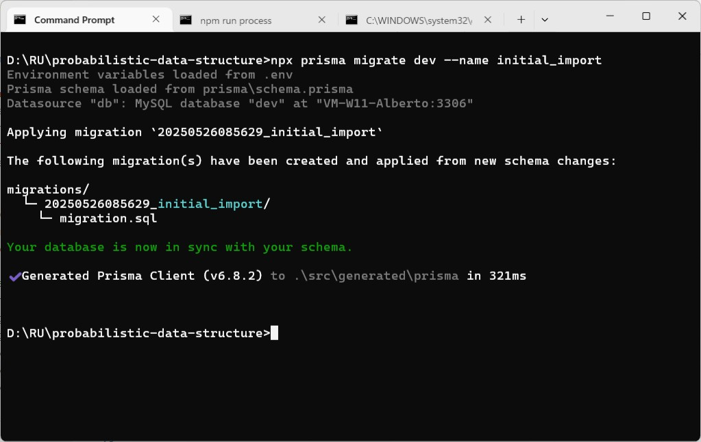

A `20250526085629_initial_import` folder is created right under `prisma` folder. Within which a `migration.sql` is created containing SQL statement: 
```
-- CreateTable
CREATE TABLE `users` (
    `id` VARCHAR(191) NOT NULL,
    `fullname` VARCHAR(191) NOT NULL,
    `email` VARCHAR(191) NOT NULL,
    `birthdate` BIGINT NOT NULL DEFAULT 19000101,
    `gender` ENUM('male', 'female', 'unknown') NOT NULL,
    `phone` VARCHAR(191) NOT NULL,
    `createdAt` DATETIME(3) NOT NULL DEFAULT CURRENT_TIMESTAMP(3),

    UNIQUE INDEX `users_email_key`(`email`),
    FULLTEXT INDEX `users_fullname_idx`(`fullname`),
    PRIMARY KEY (`id`)
) DEFAULT CHARACTER SET utf8mb4 COLLATE utf8mb4_unicode_ci;
```

Meanwhile, a table `_prisma_migrations` is created on target database, alone with the `users` table, to keep track of migration. 

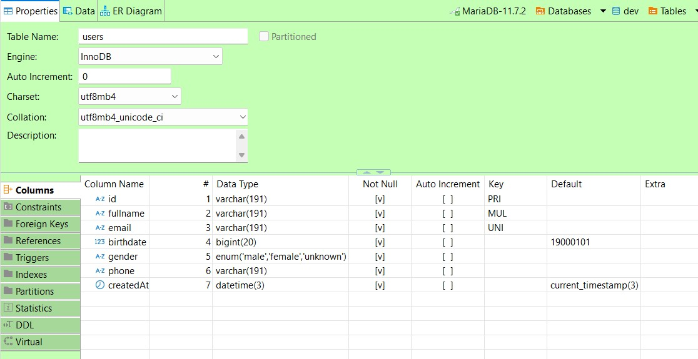
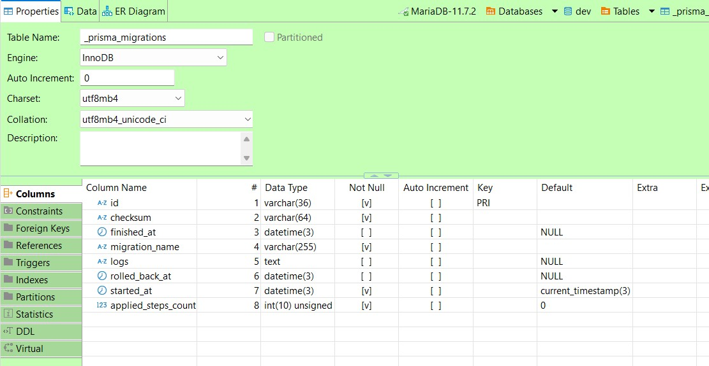


#### III. Another consumer
Instead of processing stream data, this version of consumer only write data to MariaDB using Prisma: 
```
async function processEvent(event) {
    const user = await prisma.user.create({
      data: event.message,
    })
  console.log(user)
}
```

And re-run everything again: 
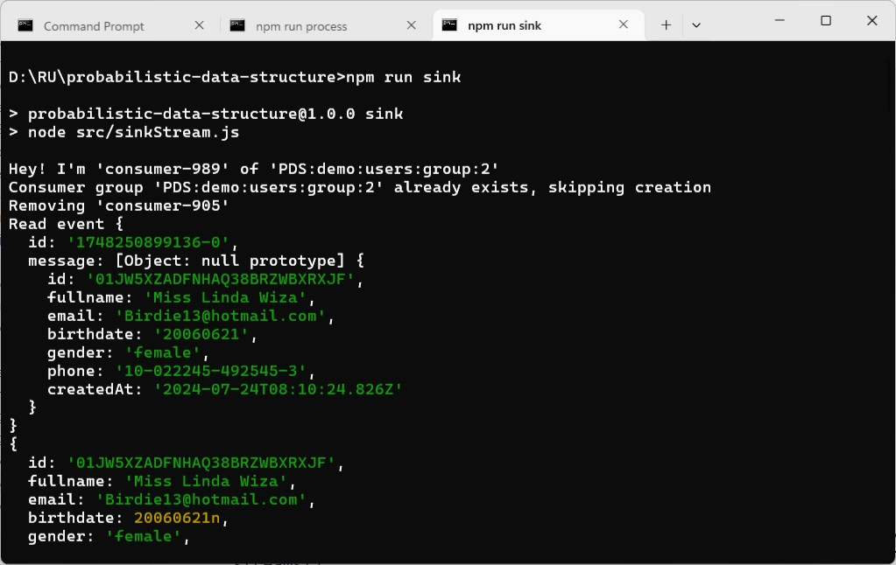

This time, data will be written to MariaDB when stream fill up again! 
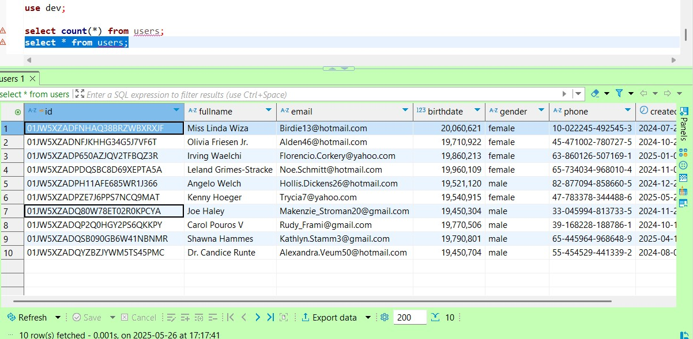


#### IV. Schema (cont.)
Things never go smooth in life and so does our user model. It is required to add three more fields, ie. `jobType`, `jobType` and `jobDescription`: 
```
export function generateUser() {
    return {
      id: faker.string.ulid(),
      fullname: faker.person.fullName(),
      email: faker.internet.email(),
      birthdate: formatDateToYYYYMMDD(faker.date.birthdate()),
      gender: faker.person.sex(),
      phone: faker.phone.imei(),

      jobTitle: faker.person.jobTitle(),
      jobType: faker.person.jobType(), 
      jobDescription: faker.lorem.sentences({ min: 5, max: 10 }), 
      
      createdAt: faker.date.past().toISOString(),
    };
  } 
```

That triggers a schema migration. 
```
npx prisma migrate dev --name add_3_job_fields --create-only 
```
Where: 
- `-n`, `--name` name the migration.
- `--create-only` create a new migration but do not apply it. The migration will be empty if there are no changes in Prisma schema. 
- `--schema` custom path to your Prisma schema.
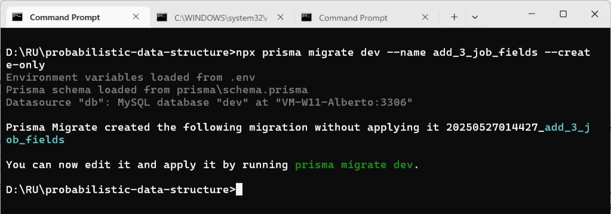

And modify `schema.prisma` accordingly: 
```
model User {
  id        String   @id @default(uuid()) // Unique user ID
  fullname  String
  email     String   @unique
  birthdate BigInt   @default(19000101) // Stored in YYYYMMDD format
  gender    Gender
  phone     String

  jobTitle  String @default("")
  jobType   String @default("")
  jobDescription  String @default("") @db.Text 
  
  createdAt DateTime @default(now()) // ISO 8601 timestamp

  @@fulltext([fullname])
  @@map("users")
}
```

To validate the schema with: 
```
npx prisma validate
```

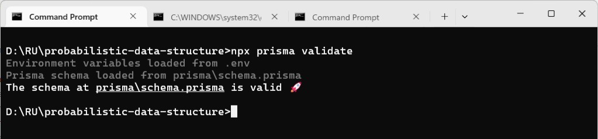

To make the schema nice and clean: 
```
npx prisma format
```

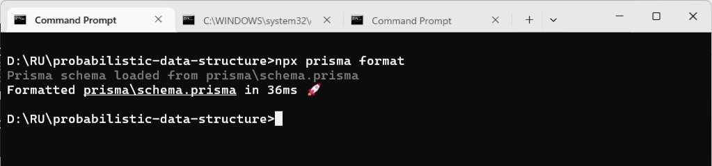

To check migration status with: 
```
npx prisma migrate status
```
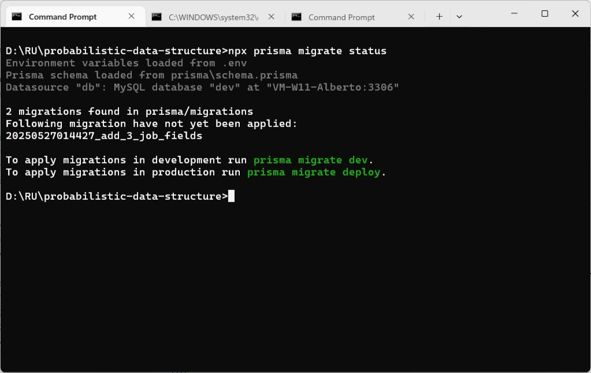

As it is suggested in the output: 
- `npx prisma migrate dev` to apply migrations in development run prisma migrate dev.
- `npx prisma migrate deply` to apply migrations in production run prisma migrate deploy.

Let's go ahead and apply the migration with: 
```
npx prisma migrate dev 
```
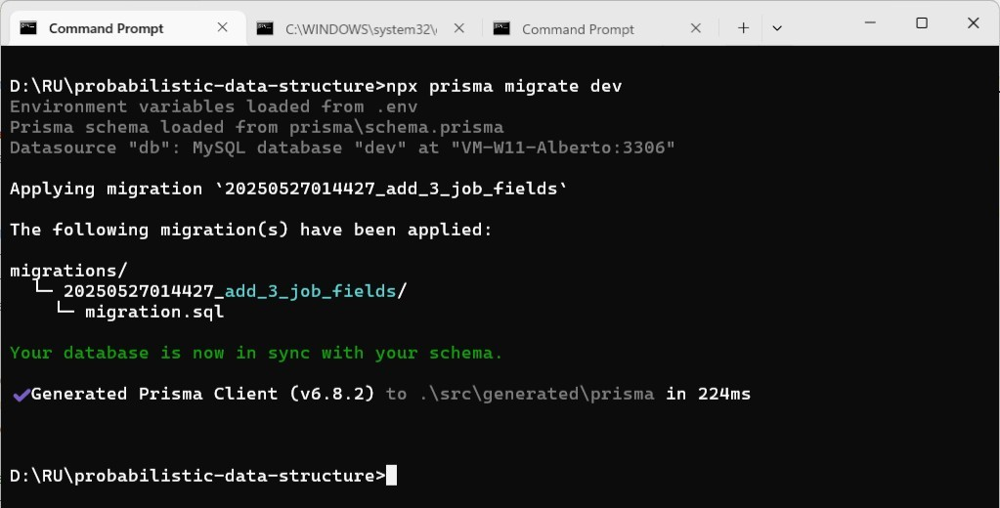

A `20250527014427_add_3_job_fields` folder is create under `prisma/migrations` folder, within which `migration.sql` contains: 
```
-- AlterTable
ALTER TABLE `users` ADD COLUMN `jobDescription` TEXT NOT NULL DEFAULT '',
    ADD COLUMN `jobTitle` VARCHAR(191) NOT NULL DEFAULT '',
    ADD COLUMN `jobType` VARCHAR(191) NOT NULL DEFAULT '';
```

We can verify `users` table in MariaDB:
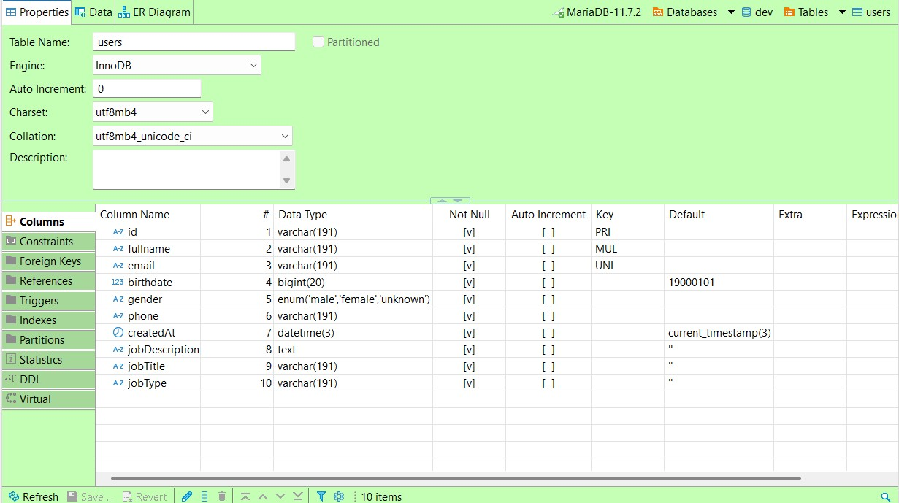


#### III. Another consumer (cont.)
As you can see, once the prisma client is generated, either in: 
```
npx prisma migrate dev --name some_more_changes
```

or explicitly by: 
```
npx prisma generate 
```
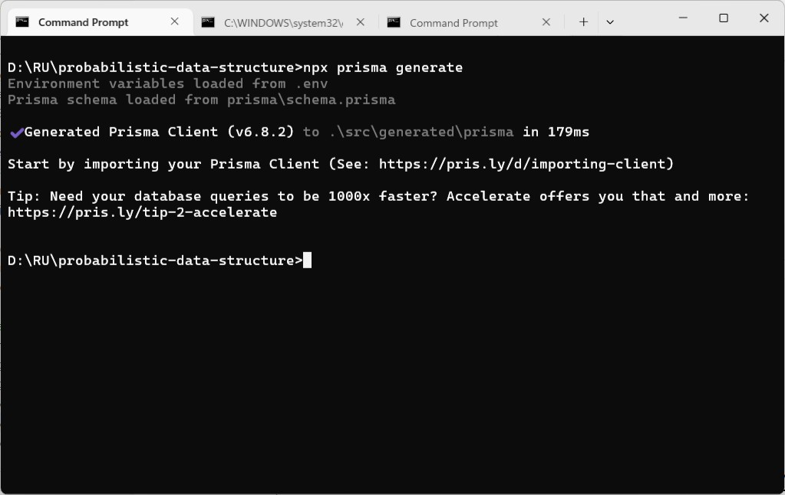

No code change is required in our case. 


```
npx prisma migrate dev --name add_3_tables --create-only
```
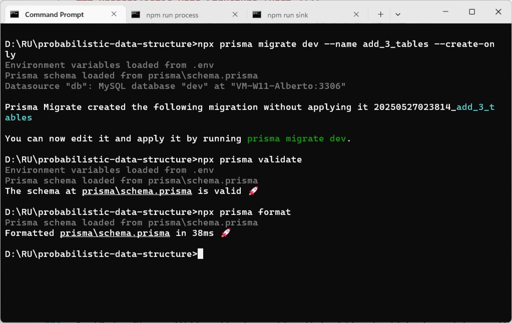

```
npx prisma migrate status
npx prisma migrate dev
```
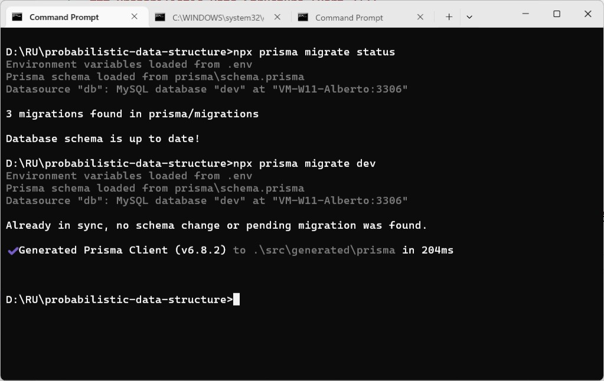

Verify on MariaDB: 
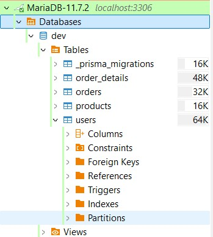


#### VI. To wrap up
Schema evolution is a complicated issue in RDBMS. To recap: 

1. Use `npx prisma migrate dev --name changes_are_required --create-only` to initiate a migration; 
2. Make changes to models defined in `prisma/schema.prisma`; 
3. Use `npx prisma validate` to check validity of models; 
4. Use `npx prisma format` to make it look better (optional);
5. Use `npx prisma migrate status` to check status of migration; 
6. Use `npx prisma migrate dev` or `npx prisma migrate deploy` to apply migration. 

Well! The last exercise is to revert everything... You know how to do that... 

```
npx prisma migrate dev --name revert_everything --create-only 
```

Comment out what you don't need in `schema.prisma` and run: 
```
npx prisma validate 
npx prisma format
npx prisma migrate status
npx prisma migrate dev 
```
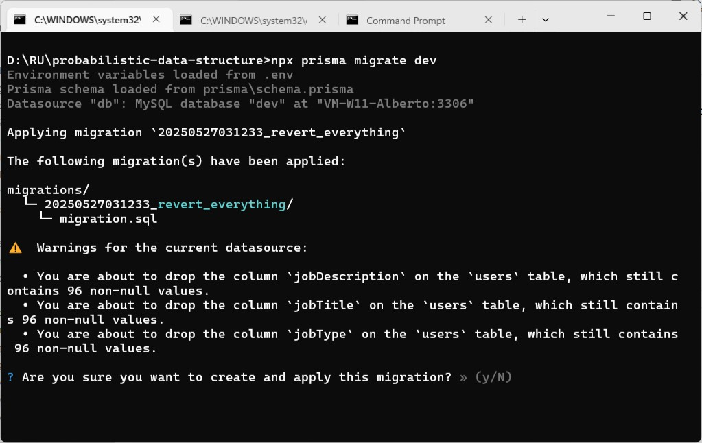

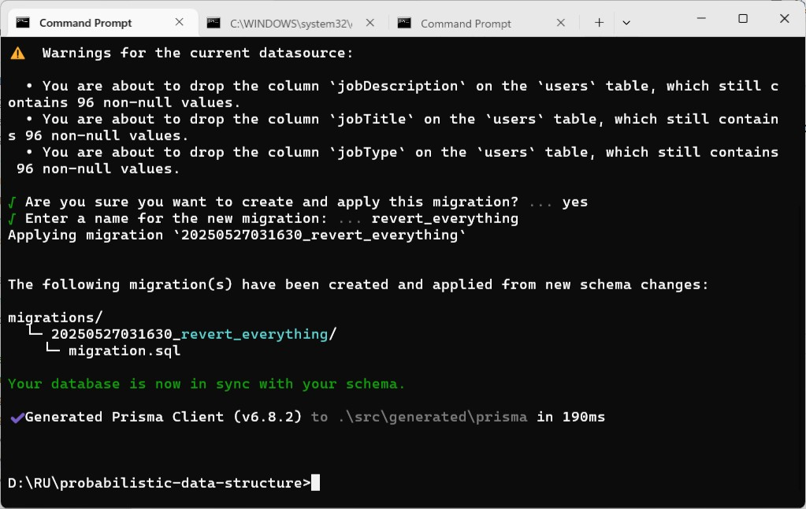


#### VII. Bibliography 
1. [Redis Streams](https://redis.io/docs/latest/develop/data-types/streams/)
2. [Prisma](https://www.prisma.io/docs/)
3. [MySQL/MariaDB](https://www.prisma.io/docs/orm/overview/databases/mysql)
4. [Getting started with Prisma Migrate](https://www.prisma.io/docs/orm/prisma-migrate/getting-started)
5. [The Castle by Franz Kafka](https://files.libcom.org/files/Franz%20Kafka-The%20Castle%20(Oxford%20World's%20Classics)%20(2009).pdf)


#### Epilogue
Now, you already know with both SQL and NoSQL, but this is only the beginning...


### EOF (2025/05/30)

npm install prisma --save-dev

npx prisma init

npx prisma validate

npx prisma db push

When to Use Redis as a Primary Database - Redis Special Topics (1/4) | System Design
https://youtu.be/BJxtLbE5sxw

Using Redis Streams instead of Kafka - Redis Special Topics (2/4) | System Design
https://youtu.be/zcCEFByssQU

I replaced my Redis cache with Postgres... Here's what happened
https://youtu.be/KWaShWxJzxQ

Count-Min Sketch: An efficient probabilistic Data Structure by Raphael De Lio
https://youtu.be/KRaSkSzwCkE

ClueCon Weekly with Guy Royse [Ep. 31]
https://youtu.be/lIMK2Mi5e40

ClueCon Weekly with Guy Royse pt. 2 [Ep. 34]
https://youtu.be/3o-xcgtf_XU