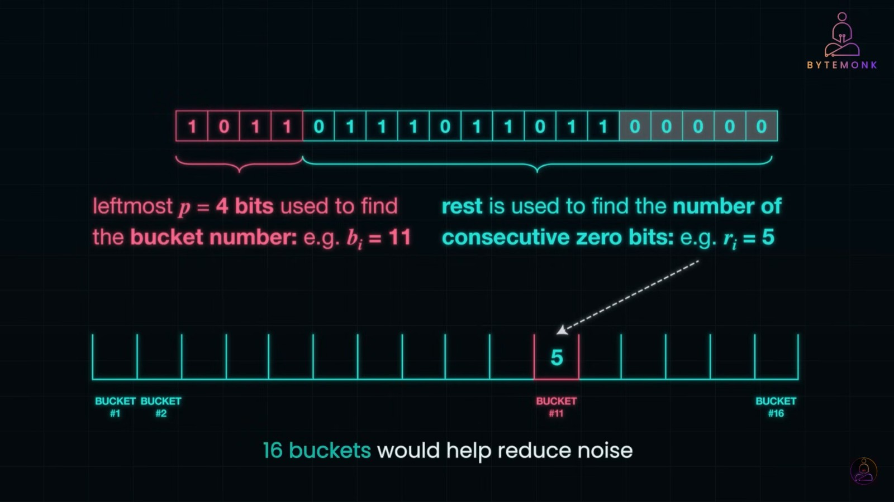
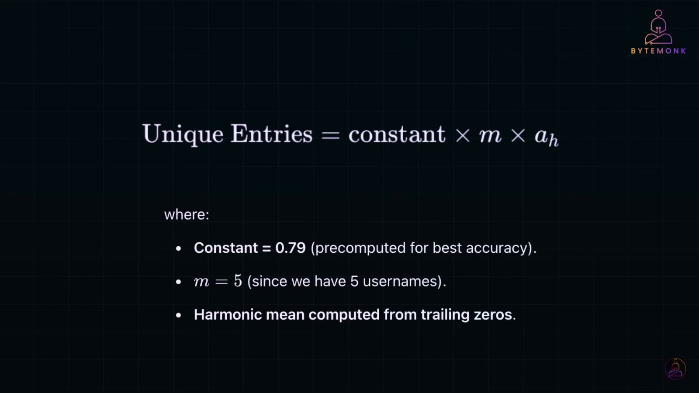
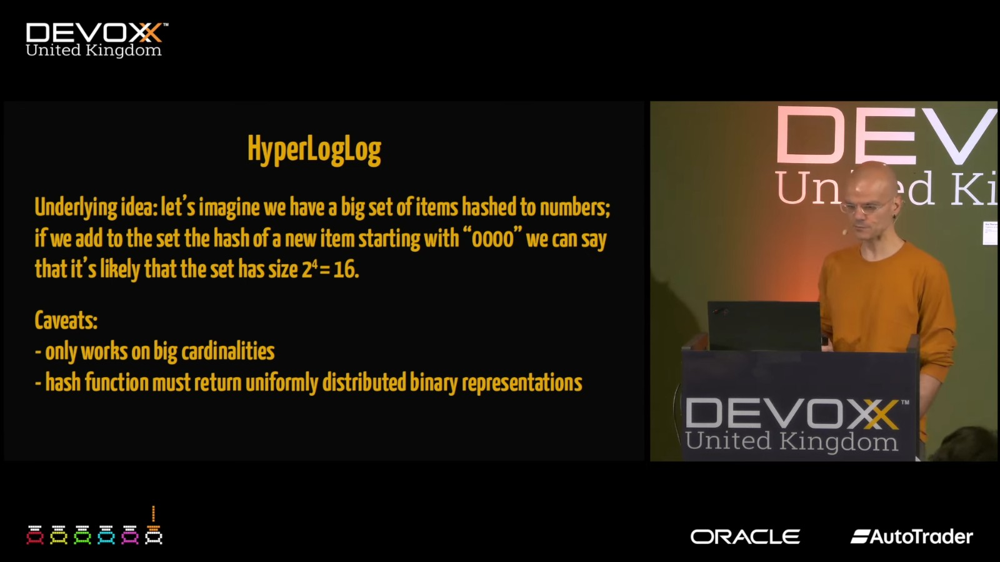
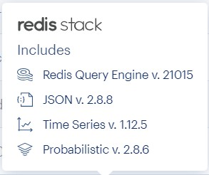
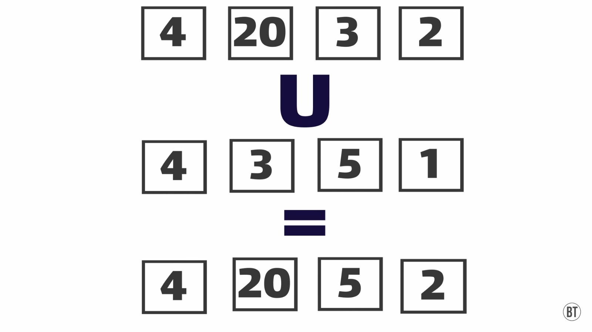
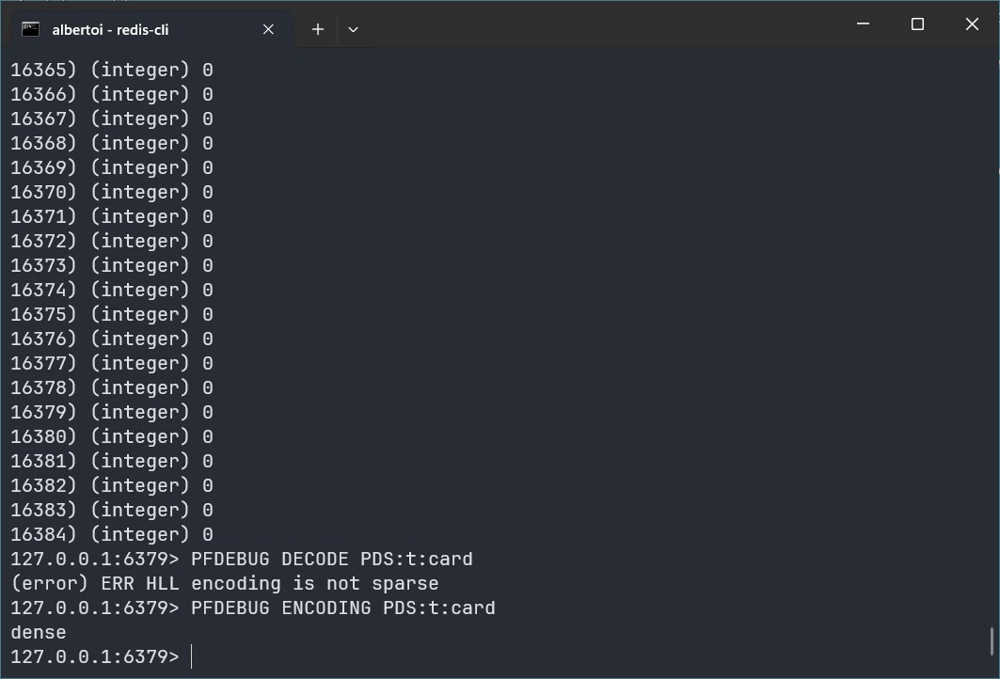
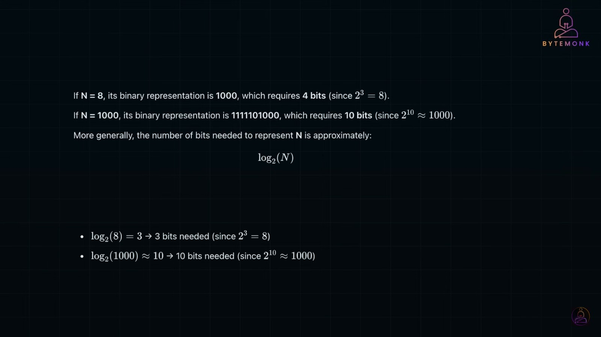
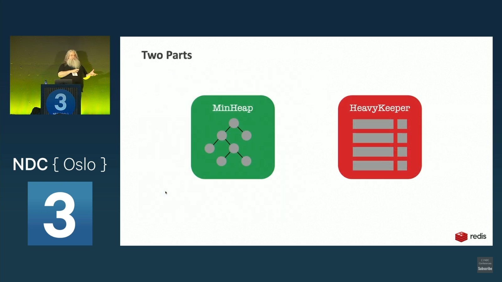

### Probabilistic Data Structure

> "'correct understanding of a matter and a misunderstanding of the same matter are not mutually exclusive'."<br />The Trial by Franz Kafka


#### Prologue
In the year of 2025, everybody is talking and doing AI things... Probabilistic Data Structure, or PDS for short, doesn't have direct bearing on AI but more to do with data analytic issue. If records to be processed are thousands then any RDBMS will do. If records to be processed are billions or trillions and you are more concerned with speed and size rather than accuracy, PDS is an obvios choice. 

AI is the thing helps to improve efficiency but quality depends, HE drives you away and astray after all. AI is crafted by human and I don't believe in human, that's why I don't believe in AI. 


#### I. Deterministic vs. Probabilistic 

Most people of my era have read the book [Algorithms and Data Structures by Niklaus Wirth 1985)](https://informatika-21.ru/pdf/AD.pdf). Data structures are simply *organized* data working in a specific way, ie. array, list, stack. queue and tree are *canonical* data structures to be taught in university, so to speak. But there are also hash, collection, bag, dictionary and many more... 

All of them shares common characteristics: 
- Resides in memory; 
- Memory consumption is proportional to number of elements; 
- No matter the order of data, it always works as expected; 
- Subject to different levels of [Time complexity](https://en.wikipedia.org/wiki/Time_complexity). 

Within organized data of any form, there are three kinds of problem: 
- Cardinality: count number of unique elements; 
- Membership: test if a specific element exists; 
- Frequency: how many times an element appears;

It is easy to handle with a table in MariaDB, for example: 
```
use test; 
CREATE TABLE t (
    id INT AUTO_INCREMENT PRIMARY KEY,
    value TEXT
);

CREATE INDEX idx_value ON t(value(255)); -- Non-unique index on first 255 characters of the 'value' field
```

After inserting sample data from `t.sql`: 
```
-- Cardinality 
SELECT COUNT(*) as card 
FROM (SELECT DISTINCT value FROM t) t1; 

99

-- Membership 
SELECT EXISTS(SELECT 1 FROM t WHERE value = 'David') AS exists_check;

1 

SELECT EXISTS(SELECT 1 FROM t WHERE value = 'Leni') AS exists_check;

0

-- Frequency 
SELECT COUNT(*) as freq FROM t WHERE value='David'; 

3

SELECT COUNT(*) as freq FROM t WHERE value='David'; 

0
```

Easy-peasy! As you can see, we use a single data structure, ie. table, to address three problems. Owning to [ACID](https://en.wikipedia.org/wiki/ACID) nature, RDBMS stores data on disk and by dint of index, it just know where to pull out data to make aggregations. 


We have 127 records and data size is 0.03MB which is ≈ 30.72KB. 


When scaling up to billions, aggregating in real time is impractical and virtually impossible. This is where PDS comes into play... 

**Caveat**

- PDS are specialized data structures to tackle *humungous* data size for specific purpose; 
- PDS trades accuracy for speed and size, you won't get 100% accuracy and have to endure false positive somehow; 
- Good estimation of elements is a **MUST** otherwise accuracy would dwindle drastically; 
---
Note: A **false positive** occurs when a test or system incorrectly identifies something as true or present when it actually isn’t. This concept is commonly used in areas like **machine learning, security, medicine, and data analysis**.


Here, I am going to demo [HyperLogLog](https://redis.io/docs/latest/develop/data-types/probabilistic/hyperloglogs/) [Bloom filter](https://redis.io/docs/latest/develop/data-types/probabilistic/bloom-filter/) and [Top-K](https://redis.io/docs/latest/develop/data-types/probabilistic/top-k/) one by one. 

After inserting sample data from `pf.redis`:
```
> PFCOUNT PDS:t:card 
(integer) 99

> MEMORY USAGE PDS:t:card
(integer) 440
```
--- 
Note: 

- The `MEMORY USAGE` command returns the memory usage of a key in bytes.
- This command provides an estimate of the memory consumed by the key and its associated value.
- The unit of measurement is bytes.


After inserting sample data from `bf.redis`:
```
> BF.CARD PDS:t:member
(integer) 99

> BF.EXISTS PDS:t:member 'David' 
(integer) 1

> BF.EXISTS PDS:t:member 'Leni'
(integer) 0

> BF.INFO PDS:t:member
1) "Capacity"
2) "100"
3) "Size"
4) "240"
5) "Number of filters"
6) "1"
7) "Number of items inserted"
8) "99"
9) "Expansion rate"
10) "2"

> MEMORY USAGE PDS:t:member
(integer) 280
```

After inserting sample data from `topk.redis`:
```
> TOPK.QUERY PDS:t:freq 'David'
1) "1"

> TOPK.QUERY PDS:t:freq 'Leni'
1) "0"

> TOPK.LIST PDS:t:freq WITHCOUNT
1) "Alice"
2) "5"
3) "Charlie"
4) "5"
5) "Bob"
6) "5"
7) "David"
8) "3"
9) "George"
10) "3"
. . . 
197) "Sebastian"
198) "1"

> TOPK.INFO PDS:t:freq
1) "k"
2) "100"
3) "width"
4) "8"
5) "depth"
6) "7"
7) "decay"
8) "0.9"

> MEMORY USAGE PDS:t:freq
(integer) 4976
```

As you can see, it is amazingly easy to use. PDS shares common characteristics:
- Resides in memory, they are data structures after all;
- Memory consumed is fixed and is based on estimated capacity; 
- The order of data may affect accuracy and thus the final outcome; 

| Operation | Description | Time complexity |
| ----------- | ----------- | ----------- |
| [PFADD](https://redis.io/docs/latest/commands/pfadd/) | Add elements to a HyperLogLog key. Create the key if it doesn't exist. | O(1) |
| [PFCOUNT](https://redis.io/docs/latest/commands/pfcount/) | Returns the approximated cardinality of the set(s) observed by the HyperLogLog key(s). | O(1) |
| [BF.ADD](https://redis.io/docs/latest/commands/bf.add/) | Adds an item to a Bloom Filter.  | O(k), where k is the number of hash functions used by the last sub-filter |
| [BF.CARD](https://redis.io/docs/latest/commands/bf.card/) | Returns the cardinality of a Bloom Filter. | O(1) |
| [BF.EXISTS](https://redis.io/docs/latest/commands/bf.exists/) |  | O(k), where k is the number of hash functions used by the last sub-filter |
| [TOPK.ADD](https://redis.io/docs/latest/commands/topk.add/) | Increase the count of one or more items by increment. | O(n * k) where n is the number of items and k is the depth |
| [TOPK.QUERY](https://redis.io/docs/latest/commands/topk.query/) | Checks wheather one or more items are in a sketch. | O(n) where n is the number of items |
| [TOPK.LIST](https://redis.io/docs/latest/commands/topk.list/) | Returns full list of items in Top K list. | O(k*log(k)) where k is the value of top-k |

O(1) is the most favourable. Different PDS may overlap in functions, it is up to you to choose one which suits your application scenario. As a last note, after adding items to PDS, it is impossible to retrieve them back as they are hashed and forgotten. If items matter, better to equip RDBMS as a kind of data sink for further processing. 


#### II. [Bloom filter](https://redis.io/docs/latest/develop/data-types/probabilistic/bloom-filter/) 
> The **Bloom filter** is named after **Burton Howard Bloom**, the computer scientist who introduced the concept in his 1970 paper titled [*Space/Time Trade-offs in Hash Coding with Allowable Errors*](https://cs.pwr.edu.pl/cichon/2021_22_a/BigData/Bloom.pdf). Bloom devised this probabilistic data structure to efficiently test for set membership while minimizing memory usage. Interestingly, Bloom filters have inspired many variations, including **Counting Bloom Filters, Cuckoo Filters, and Partitioned Bloom Filters**, each refining the original concept for different applications. 

> The default capacity for Bloom filters is 100, and the default error rate is 0.01. For more details, you can refer to the documentation [here](https://redis.io/docs/latest/develop/data-types/probabilistic/configuration/?utm_source=redisinsight&utm_medium=app&utm_campaign=ai_assistant).

- [BF.RESERVE](https://redis.io/docs/latest/commands/bf.reserve/) in Redis is used to pre-allocate memory for a Bloom Filter. It helps to establish the initial capacity and error rate for the filter before any elements are added to it.
```
BF.RESERVE key error_rate capacity [EXPANSION expansion]
  [NONSCALING]
```
> By default, the filter auto-scales by creating additional sub-filters when capacity is reached. The new sub-filter is created with size of the previous sub-filter multiplied by expansion.

> Though the filter can scale up by creating sub-filters, it is recommended to reserve the estimated required capacity since maintaining and querying sub-filters requires additional memory (each sub-filter uses an extra bits and hash function) and consume further CPU time than an equivalent filter that had the right capacity at creation time.

> The size of the new sub-filter is the size of the last sub-filter multiplied by expansion, specified as a positive integer. If the number of items to be stored in the filter is unknown, you use an expansion of 2 or more to reduce the number of sub-filters. Otherwise, you use an expansion of 1 to reduce memory consumption. The default value is 2.

> Non-scaling filters requires slightly less memory than their scaling counterparts. The filter returns an error when capacity is reached.

Reserved with an error rate 1%, capacity 1000 and expansion factor of 2.
```
BF.RESERVE bf_exp 0.01 1000 EXPANSION 2
```
Reserved with an error rate 1%, capacity 1000 and without auto-scaling.
```
BF.RESERVE bf_non 0.01 1000 NONSCALING
```

> [BF.ADD](https://redis.io/docs/latest/commands/bf.add/) returns [] on error (invalid arguments, wrong key type, etc.) and also when the filter is full.

> [BF.INFO](https://redis.io/docs/latest/commands/bf.info/) returns information about a Bloom filter. 
```
> BF.INFO PDS:t:member
1) "Capacity"
2) "100"
3) "Size"
4) "240"
5) "Number of filters"
6) "1"
7) "Number of items inserted"
8) "99"
9) "Expansion rate"
10) "2"
```

> In Redis implementation of a Bloom filter, there are no arrays used as in a Bloom filter. A Bloom filter consists of hashed representations of items, not arrays like a Bloom filter's bit array. For Redis Bloom filters, membership queries check for the presence of item fingerprints in the filter based on hash functions. It utilizes one hash function for hashing elements and determining their storage locations within the data structure.

More resource: 
- [Bloom Filter Calculator](https://hur.st/bloomfilter/)

- [Bloom Filters by Example](https://llimllib.github.io/bloomfilter-tutorial/)

- [Configuration Parameters](https://redis.io/docs/latest/develop/data-types/probabilistic/configuration/#bf-initial-size) for Bloom filter and Cuckoo filter. 

- [Probabilistic data structure commands](https://redis.io/docs/latest/operate/oss_and_stack/stack-with-enterprise/bloom/commands/) for Bloom filter, Cuckoo filter and Top-k. 


#### III. Cuckoo Filter 

> The **Cuckoo Filter**, introduced by researchers Bin Fan, David Andersen, and Michael Kaminsky in 2014 titled [Cuckoo Filter: Practically Better Than Bloom](https://www.cs.cmu.edu/~dga/papers/cuckoo-conext2014.pdf), is a **probabilistic data structure** used for approximate membership testing, much like a Bloom filter but with added flexibility.

> The naming comes from **Cuckoo Hashing**, a hashing technique where collisions are resolved by **displacing** existing entries—similar to how a cuckoo chick pushes other eggs out of the nest.

> In **Cuckoo Filters**, when an item is inserted and its designated position is occupied, the filter evicts an existing item and attempts to relocate it to another slot, just like Cuckoo Hashing.

> The default capacity for Cuckoo filters is 1024, and the default error rate is 0.01. For more information, you can refer to the documentation [here](https://redis.io/docs/latest/develop/data-types/probabilistic/cuckoo-filter/?utm_source=redisinsight&utm_medium=app&utm_campaign=ai_assistant).

- [CF.RESERVE](https://redis.io/docs/latest/commands/cf.reserve/) in Redis is used to pre-allocate memory for a Cuckoo Filter. It allows you to establish the initial capacity for the filter. 

```
CF.RESERVE key capacity [BUCKETSIZE bucketsize]
  [MAXITERATIONS maxiterations] [EXPANSION expansion]
```
> While the Bloom filter is a bit array with flipped bits at positions decided by the hash function, a Cuckoo filter is an array of buckets, storing fingerprints of the values in one of the buckets at positions decided by the two hash functions. A membership query for item x searches the possible buckets for the fingerprint of x, and returns true if an identical fingerprint is found. A cuckoo filter's fingerprint size will directly determine the false positive rate.

> `bucketsize` is an integer between 1 and 255. The default value is 2. A higher bucket size value improves the fill rate but also causes a higher error rate and slightly slower performance.

> For example, when `bucketsize` is set to 3, a maximum of 3 fingerprints can be stored in the same location. This setting allows multiple entries in a bucket, with each entry containing a unique fingerprint. This feature helps optimize the fill rate of the filter without leading to false positives and maintains efficient performance.

> `maxiterations` is an integer between 1 and 65535. The default value is 20. Number of attempts to swap items between buckets before declaring filter as full and creating an additional filter. A low value is better for performance and a higher number is better for filter fill rate.

> `expansion` is an integer between 0 and 32768. The default value is 1. When a new filter is created, its size is the size of the current filter multiplied by expansion. Expansion is rounded to the next 2^n number.

Reserved with capacity 1000,000, buckersize 2, maxiterations 20, expansion 1.
```
CF.RESERVE bikes:models 1000000 BUCKETSIZE 2
  MAXITERATIONS 20 EXPANSION 1
```

> [CF.ADD](https://redis.io/docs/latest/commands/cf.add/) returns [] on error (invalid arguments, wrong key type, etc.) and also when the filter is full. 

> Time complexity is O(n + i), where n is the number of sub-filters and i is maxIterations. Adding items requires up to 2 memory accesses per sub-filter. But as the filter fills up, both locations for an item might be full. The filter attempts to Cuckoo swap items up to maxIterations times.

[CF.EXISTS](https://redis.io/docs/latest/commands/cf.exists/), [CF.COUNT](https://redis.io/docs/latest/commands/cf.count/) and [CF.INFO](https://redis.io/docs/latest/commands/cf.info/). 

After inserting sample data from `cf.redis`:
```
> CF.EXISTS PDS:t:memdel 'David' 
(integer) 1

> CF.EXISTS PDS:t:memdel 'Leni' 
(integer) 0

> CF.COUNT PDS:t:memdel 'David' 
(integer) 3

> CF.COUNT PDS:t:memdel 'Leni'
(integer) 0

> CF.INFO PDS:t:memdel 
1) "Size"
2) "2120"
3) "Number of buckets"
4) "512"
5) "Number of filters"
6) "2"
7) "Number of items inserted"
8) "127"
9) "Number of items deleted"
10) "0"
11) "Bucket size"
12) "2"
13) "Expansion rate"
14) "1"
15) "Max iterations"
16) "20"

> memory usage PDS:t:memdel
(integer) 2160
```

> [CF.DEL](https://redis.io/docs/latest/commands/cf.del/) Deletes an item once from the filter. If the item exists only once, it will be removed from the filter. If the item was added multiple times, it will still be present. **Deleting an item that are not in the filter may delete a different item, resulting in false negatives**. 

**Caveat**

- Cuckoo Filter in Redis has far more tuning parameters then Bloom filter. `CF.ADD` is O(k + i), where k is the number of sub-filters and i is maxIterations; `CF.COUNT`, `CF.EXISTS` and `CF.DEL` are O(k), where k is the number of sub-filters. 

- `BF.ADD` and `BF.EXISTS` are O(k), where k is the number of hash functions used by the last sub-filter; `BF.CARD` is O(1).

- In a word, Cuckoo Filter can do Membership, Frequency and delete items; Bloom filter can do Cardinality, Membership but can not delete items; 
```
> MEMORY USAGE PDS:t:member
(integer) 280

> MEMORY USAGE PDS:t:memdel
(integer) 2160
```
> In the implementation of a Cuckoo Filter in Redis, it consists of an array of buckets that store fingerprints of values, not two arrays like a Bloom filter's bit array. Membership queries in a Cuckoo filter search for the fingerprint of the item in the buckets based on hash functions. It utilizes two hash functions for hashing elements and determining their storage locations within the filter.

More resource: 
- [Probabilistic Filters By Example](https://bdupras.github.io/filter-tutorial/)

- [Configuration Parameters](https://redis.io/docs/latest/develop/data-types/probabilistic/configuration/#bf-initial-size) for Bloom filter and Cuckoo filter. 

- [Probabilistic data structure commands](https://redis.io/docs/latest/operate/oss_and_stack/stack-with-enterprise/bloom/commands/) for Bloom filter, Cuckoo filter and Top-k. 

---
> Note: Bloom Filters and Cuckoo Filters are called "filters" because their primary function is to efficiently determine *whether an element is probably in a set or definitely not* ─── essentially acting as *screening mechanisms* for data. They are used for *fast membership testing* while minimizing memory usage.

> Other probabilistic data structures, like HyperLogLog, Count-Min Sketch, and Top-K, focus on *approximate counting, frequency estimation, or ranking* rather than membership testing. Since these structures *don’t filter elements out* but instead *aggregate data*, they are not classified as "filters."


#### IV. [HyperLogLog](https://redis.io/docs/latest/develop/data-types/probabilistic/hyperloglogs/)

> **HyperLogLog** was introduced by **Philippe Flajolet** and his colleagues in a 2007 paper [HyperLogLog: the analysis of a near-optimal cardinality estimation algorithm](https://algo.inria.fr/flajolet/Publications/FlFuGaMe07.pdf), refining earlier probabilistic counting methods. It has since become widely used in big data analytics, databases, and network monitoring due to its ability to estimate large cardinalities with minimal memory usage.

> The name **HyperLogLog** comes from its predecessor, the **LogLog algorithm**, which was designed for estimating the number of distinct elements in a dataset. HyperLogLog is an enhanced version of LogLog, hence the prefix **"Hyper"**, indicating its improved accuracy and efficiency.

> The original **LogLog algorithm** was developed based on the idea of using the maximum number of leading zeros in hashed values to estimate cardinality. HyperLogLog builds upon this by introducing [Harmonic mean](https://en.wikipedia.org/wiki/Harmonic_mean) instead of [Arithmetic mean](https://en.wikipedia.org/wiki/Arithmetic_mean) and **M-Bucket**, significantly reducing estimation error caused by extreme values while maintaining a compact memory footprint. 



If dataset has many distinct values, it is said to be of *high cardinality*; if dataset has only a few distinct values, it is said to be of *low cardinality*. HyperLogLog works best on BIG volume of data with randomn distribution and keeps 98% accuracy. 


HyperLogLog is state-of-the-art cardinality estimation algorithm. It was introduced to Redis version 2.8.9 in 2014 and was built into Redis core, not necessarily on Redis Stack. 


[PFMERGE](https://redis.io/docs/latest/commands/pfmerge/) Merges one or more HyperLogLog values into a single key.


> While you cannot directly see the individual elements stored in a HyperLogLog, you can get information about the raw data.
```
> TYPE PDS:t:card
"string"

> GET PDS:t:card
"HYLL\x01\x00\x00\x00c\x00\x00\x00\x00\x00\x00\x00Ay\x84@E\x84@m\x88@\xd2\x80@\xba\x84@\xb2\x80\x16\x80A\x85\x84\x1d\x80A8\x80@D\x80\x1f\x80@A\x84@R\x80@\xaf\x80\x00\x805\x80\x1c\x88\x1d\x8c@\x8c\x84@\xa8\x88@\xe9\x80@\xff\x80@\x98\x88@\x98\x84@h\x80@t\x84BX\x80B\xc2\x80\x03\x8c$\x8c@K\x80@\xdb\x80\a\x84@i\x80@P\x88\x17\x80@A\x88@E\x80@\x8a\x8c<\x80@\xba\x94\x02\x8c\x1f\x80A\x80\x801\x80\x12\x80A\n\x84@\xcc\x80\x10\x80A\xab\x80@\xcd\x80%\x88A\x12\x80\b\x88A*\x9cB]\x80@O\x904\x8c\x16\x84@\xcf\x80@U\x80@[\x88@C\x800\x80\n\x80@P\x88\x12\x80\x0f\x84Ar\x80AA\x8c\x0f\x80A\xa0\x84\x1c\x84@\xb7\x80A\x15\x84A\xc6\x8c@y\x80@g\x8c@j\x80A)\x80@[\x80B\x8c\x80C\xda\x84@[\x80.\x80<\x90!\x80@\x98\x80@c\x84@G\x80@k\x80@w\x84=\x88\x1c\x80@S\x80@a\x84@E\x84A\xac\x9cB\a"

> DEBUG OBJECT PDS:t:card
"Value at:00007FD703C2E8A0 refcount:1 encoding:raw serializedlength:285 lru:2373191 lru_seconds_idle:9"
> 
```

> Note: The [DEBUG](https://redis.io/docs/latest/commands/debug/) command in Redis provides several subcommands that are useful for debugging and inspecting the internal state of the Redis server and its data structures. Here are the available DEBUG subcommands along with examples of how to use them:
1. `DEBUG OBJECT key`: Provides information about the internal representation of a key.
2. `DEBUG SEGFAULT`: Causes a segmentation fault in the server, useful for testing crash recovery.
3. `DEBUG RELOAD`: Synchronously save the dataset to disk and reload it back.
4. `DEBUG HTSTATS db`: Provides hash table statistics for a specific database, which ranges from 0 to 15. 
5. `DEBUG SDSLEN key`: Provides the length of the Simple Dynamic Strings (SDS) used to store the key and value.
6. `DEBUG DIGEST`: Returns a 64-bit digest of the dataset.
7. `DEBUG ZIPLIST`: Provides information about the internal representation of a ziplist.
8. `DEBUG POPULATE count [prefix]`: Populates the database with a specified number of keys for testing.
9. `DEBUG SETACTIVEEXPIRE percentage`: Sets the active expire cycle to a specified percentage.
```
# Provides information about the internal representation of a key
DEBUG OBJECT my_key
# Causes a segmentation fault in the server
DEBUG SEGFAULT
# Synchronously save the dataset to disk and reload it back
DEBUG RELOAD
# Provides hash table statistics for a specific database
DEBUG HTSTATS 0
# Provides the length of the Simple Dynamic Strings (SDS) used to store the key and value
DEBUG SDSLEN my_key
# Returns a 64-bit digest of the dataset
DEBUG DIGEST
# Provides information about the internal representation of a ziplist
DEBUG ZIPLIST my_ziplist
# Populates the database with a specified number of keys for testing
DEBUG POPULATE 1000 my_key_
# Sets the active expire cycle to a specified percentage
DEBUG SETACTIVEEXPIRE 50
```

> In Redis, a ziplist is a specially encoded data structure used to store small collections of elements in a compact way. Ziplists are used internally by Redis to optimize memory usage for certain data types, such as small lists, hashes, and sorted sets. You don't directly create or manage ziplists; instead, Redis automatically uses ziplists for certain data structures when they meet specific criteria.

> The default capacity for HyperLogLog in Redis is up to 12 KB and provides a standard error of 0.81%. For more information, you can refer to the documentation [here](https://redis.io/docs/latest/develop/data-types/probabilistic/hyperloglogs/?utm_source=redisinsight&utm_medium=app&utm_campaign=ai_assistant).

> The HyperLogLog can estimate the cardinality of sets with up to 18,446,744,073,709,551,616 (2^64) members.

> In Redis, the implementation of HyperLogLog typically utilizes one hash function for hashing elements and determining their storage locations within the data structure. It uses the harmonic mean for cardinality estimation, which is a factor in determining the number of elements in a set. It achieves efficient memory usage with a standard error of approximately 0.81%. 

> The number of buckets used is 16,384 (2¹⁴). These buckets, also known as registers, store the maximum observed leading zero count for hashed elements, which is crucial for estimating cardinality. 

> Each bucket (or register) is 6 bits in size. Since Redis uses 16,384 buckets (2¹⁴), the total memory required for a HyperLogLog structure is 12 KB (16,384 × 6 bits ≈ 12 KB). This fixed memory footprint allows Redis to efficiently estimate cardinality while maintaining a standard error rate of 0.81%. 

> The [PFDEBUG](https://redis.io/docs/latest/commands/pfdebug/) command in Redis is used to inspect the internal state of a HyperLogLog data structure. This command is useful for debugging and understanding the internal representation of the HyperLogLog.
1. `PFDEBUG GETREG key`: Returns the raw register values of the HyperLogLog.
2. `PFDEBUG DECODE key`: Decodes the internal representation of the HyperLogLog and provides a human-readable output.
3. `PFDEBUG ENCODING key`: Returns the encoding type of the HyperLogLog.

```
PFDEBUG GETREG PDS:t:card 
PFDEBUG DECODE PDS:t:card 
PFDEBUG ENCODING PDS:t:card
```


More resource: 
- [Redis HyperLogLog probabilistic cardinality approximation](https://github.com/redis/redis/blob/unstable/src/hyperloglog.c)

- [HyperLogLog in Practice: Algorithmic Engineering of a State of The Art Cardinality Estimation Algorithm](https://static.googleusercontent.com/media/research.google.com/en//pubs/archive/40671.pdf)

- [HyperLogLog: the analysis of a near-optimal cardinality estimation algorithm](https://algo.inria.fr/flajolet/Publications/FlFuGaMe07.pdf)

---
Note: If the size of dataset is 1000, Log(1000) ≈ 9.96 (base 2) which means number of leading/trailing zeros to count is 10; Log(10) ≈ 3.32 (base 2) which means number of bits required in each bucket is 4. This is why **LogLog** is called. 



#### V. [Top-K](https://redis.io/docs/latest/develop/data-types/probabilistic/top-k/)

> Finding the largest K elements (a.k.a. keyword frequency) in a data set or a stream is a common functionality requirement for many modern applications. This is often a critical task used to track network traffic for either marketing or cyber-security purposes, or serve as a [game leaderboard](https://redis.io/solutions/leaderboards/) or a simple word counter. The latest implementation of Top-K in our [Probabilistic feature](http://redisbloom.io/) uses an algorithm, called HeavyKeeper1, which was proposed by a group of researchers.

- [MinHeap](https://www.geeksforgeeks.org/what-is-min-heap/) is a [complete binary tree](https://www.geeksforgeeks.org/complete-binary-tree/), where value of each node is smaller than or equal to the values of its children. Therefore, Min Heap stores the **minimum** value at the root of the heap. Min Heap is used to maintain the minimum element in a collection of data.
- [HeavyKeeper](https://www.usenix.org/system/files/conference/atc18/atc18-gong.pdf) is an algorithm designed for identifying the **top-k "elephant flows"** in network traffic. Elephant flows are large data streams that contribute significantly to overall network traffic. HeavyKeeper uses a **count-with-exponential-decay** strategy to efficiently track and estimate the sizes of these flows while minimizing memory usage.

[TOPK.RESERVE](https://redis.io/docs/latest/commands/topk.reserve/) initializes a TopK with specified parameters.`
```
TOPK.RESERVE key topk [width depth decay]
```
Parameters: 
- `key`: Key under which the sketch is to be found.
- `topk`: Number of top occurring items to keep.

Optional parameters
- `width`: Number of counters kept in each array. (Default 8)
- `depth`: Number of arrays. (Default 7)
- `decay`: The probability of reducing a counter in an occupied bucket. It is raised to power of it's counter (decay ^ bucket[i].counter). Therefore, as the counter gets higher, the chance of a reduction is being reduced. (Default 0.9)

> As a rule of thumb, width of k*log(k), depth of log(k) or minimum of 5, and decay of 0.9, yield good results. You could run a few tests to fine tune these parameters to the nature of your data.

```
> topk.info PDS:t:freq
1) "k"
2) "100"
3) "width"
4) "8"
5) "depth"
6) "7"
7) "decay"
8) "0.9"
```

> The default capacity for Top-K in Redis is 1000, and the default error rate is 0.01. For more details, you can refer to the documentation [here](https://redis.io/docs/latest/develop/data-types/probabilistic/top-k/?utm_source=redisinsight&utm_medium=app&utm_campaign=ai_assistant).

> In Redis, the Top-K implementation utilizes a hash table for probabilistic counts and a min heap for the K items with the highest counts. This strategy ensures accuracy with shorter execution times compared to previous algorithms. The Redis Top-K implementation does not require hash functions as it is based on probabilistic counting and heap structures for efficient operations.

More resource: 
- [Probabilistic data structure commands](https://redis.io/docs/latest/operate/oss_and_stack/stack-with-enterprise/bloom/commands/) for Bloom filter, Cuckoo filter and Top-k. 


#### VI. Retrospection
As you can see, implementation of PDS in Redis is significantly different from the *original* paper. I don't know this deviation is good or not for everything has a reason... Finally, here’s a table of PDS in Redis.

| **Data Structure**   | **Year Introduced** | **Redis Component** | **Purpose** |
|----------------------|--------------------|----------------------|-------------|
| **HyperLogLog**      | 2014               | **Redis Core**       | Cardinality |
| **Bloom Filter**     | 2019               | **RedisBloom Module** | Cardinality and Membership |
| **Cuckoo Filter**    | 2019               | **RedisBloom Module** | Membership and frequency |
| **Count-Min Sketch** | 2019               | **RedisBloom Module** | Frequency (similar to Counting Bloom Filter) |
| **Top-K**           | 2019               | **RedisBloom Module** | Membership and frequency |
| **T-Digest**        | 2019               | **RedisBloom Module** | Frequency |

There is no doubt Redis is way before in Vectors, which is the root of AI, and PDS. It is ahead of the game, so to speak... PDS are advanced dsta structures you won't learn in college text book. They are ingenious design and fascinating in nature. 


#### VII. Bibliography 
1. [Probabilistic](https://redis.io/docs/latest/develop/data-types/probabilistic/)
2. [Probabilistic Data Structures - Bloom Filters, HyperLogLogs & Cuckoo Filters](https://youtu.be/dq-0xagF7v8)
3. [Understanding Probabilistic Data Structures with 112,092 UFO Sightings - Guy Royse - NDC Oslo 2023](https://youtu.be/M6XOniVANKI)
4. [Understanding Probabilistic Data Structures with UFO Sightings | Guy Royse](https://youtu.be/2Dzc7fxA0us)
5. [Intro to Probabilistic Data Structures by ANDREA IACONO](https://youtu.be/Y66Uy1he3Vo)
6. [Probabilistic data structures by Andrea Iacono](https://youtu.be/bYyRwGFSFbQ)
7. [A problem so hard even Google relies on Random Chance](https://youtu.be/lJYufx0bfpw)
8. [Counting BILLIONS with Just Kilobytes? Meet HyperLogLog!](https://youtu.be/f69hh3KgFEk)
9. [HyperLogLog: A Simple but Powerful Algorithm for Data Scientists](https://chengweihu.com/hyperloglog/)
10. [HeavyKeeper: An Accurate Algorithm for Finding Top-k Elephant Flows](https://www.usenix.org/system/files/conference/atc18/atc18-gong.pdf)
11. [Meet Top-K: an Awesome Probabilistic Addition to Redis Features](https://redis.io/blog/meet-top-k-awesome-probabilistic-addition-redis/)
12. [The Trial by Franz Kafka](https://www.gutenberg.org/cache/epub/7849/pg7849-images.html)


#### Epilogue
> "Finally his eyes grow dim, and he no longer knows whether it's really getting darker or just his eyes that are deceiving him. But he seems now to see an inextinguishable light begin to shine from the darkness behind the door. He doesn't have long to live now." <br />The Trial by Franz Kafka


### EOF (2025/05/30)

#### Bonus (written by copilot)

**[The Midwich Cuckoos](https://youtu.be/WCS4v711yck)** is a British sci-fi drama based on [John Wyndham](https://en.wikipedia.org/wiki/John_Wyndham)’s classic novel. The series takes place in the quiet town of Midwich, where an unexplained phenomenon causes every resident to lose consciousness simultaneously. When they wake, all women of childbearing age discover they are mysteriously pregnant. As time passes, the children born from this event exhibit eerie intelligence, unnatural abilities, and a shared connection, leaving the town in fear of their growing power.

The show explores themes of control, survival, and human instincts, blending psychological horror with science fiction. As the children develop, tensions rise between them and the adults struggling to understand their purpose and motives. The eerie atmosphere, coupled with unsettling performances, keeps the audience on edge, questioning the true nature of these children and their origins. 

Across its seven episodes, the series delivers a gripping narrative filled with moral dilemmas, emotional conflicts, and an overarching mystery that deepens with every revelation. With a mix of suspense and thought-provoking storytelling, **The Midwich Cuckoos** offers a modern twist on Wyndham’s unsettling tale of inexplicable power and the dangers of what lies beyond human comprehension. 


Cuckoo birds are **brood parasites**, meaning they do not raise their own young. Instead, a female cuckoo lays her eggs in the nests of other bird species, tricking them into raising her chicks. She carefully chooses host birds with eggs similar in appearance to her own, ensuring the foster parents won’t detect the intruder. Often, she removes one of the host’s eggs to maintain the clutch size, further reducing suspicion.

Once the cuckoo chick hatches, it instinctively pushes the other eggs or hatchlings out of the nest, securing all food and care for itself. The foster parents, unaware of the deception, tirelessly feed and nurture the growing cuckoo chick, which often grows much larger than its unsuspecting caretakers. This process ensures the young cuckoo receives ample resources without competition.

The strategy allows cuckoos to reproduce efficiently without investing in parental care, but it comes at a cost to the host birds, whose own offspring rarely survive. This fascinating yet ruthless survival technique highlights nature’s complex interactions and adaptations. Despite its parasitic behavior, the cuckoo plays an important role in ecological balance, shaping the evolution of host species to develop defenses against deception. 
