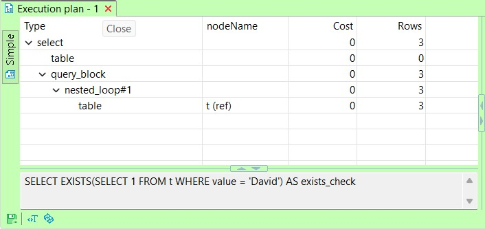

### Probabilistic Data Structure

> "Finally his eyes grow dim, and he no longer knows whether it's really getting darker or just his eyes that are deceiving him. But he seems now to see an inextinguishable light begin to shine from the darkness behind the door. He doesn't have long to live now." 


#### Prologue
In the year of 2025, everybody is talking and doing AI things... Probabilistic Data Structure, or PDS for short, doesn't have direct bearing on AI but more to do with data analytic issue. If records to be processed are thousands then any RDBMS will do. If records to be processed are billions or trillions and you are more concerned with speed and size rather than accuracy, PDS is an obvios choice. 


#### I. Deterministic vs. Probabilistic 
Most people of my era have read the book [Algorithms and Data Structures by Niklaus Wirth 1985)](https://informatika-21.ru/pdf/AD.pdf). Data structures are simply *organized* data working in a specific way, ie. array, list, stack. queue and tree are *canonical* data structures to be taught in university, so to speak. But there are also hash, collection, bag, dictionary and many more... 

All of them shares common characteristics: 
- Resides in memory; 
- Memory consumption is proportional to number of elements; 
- No matter the order of data, it always works as expected; 
- Subject to different levels of [Time complexity](https://en.wikipedia.org/wiki/Time_complexity). 

Within organized data of any form, there are three kinds of problem: 
- Cardinality: count number of unique elements; 
- Membership: test if a specific element exists; 
- Frequency: how many times an element appears;

It is easy to handle with a table in MariaDB, for example: 
```
use test; 
CREATE TABLE t (
    id INT AUTO_INCREMENT PRIMARY KEY,
    value TEXT
);

CREATE INDEX idx_value ON t(value(255)); -- Non-unique index on first 255 characters of the 'value' field
```

After inserting sample data from `t.sql`: 
```
-- Cardinality 
SELECT COUNT(*) as card 
FROM (SELECT DISTINCT value FROM t) t1; 

99

-- Membership 
SELECT EXISTS(SELECT 1 FROM t WHERE value = 'David') AS exists_check;

1 

-- Frequency 
SELECT COUNT(*) as freq FROM t WHERE value='David'; 

3
```

Easy-peasy! As you can see, we use a single data structure, ie. table, to address three problems. Owning to the [ACID](https://en.wikipedia.org/wiki/ACID) nature, RDBMS stores data on disk. By means of index, it just know where to pull out data to make aggregation. 




We have 127 records and data size is 0.03MB which is ≈ 30.72KB. 


When scaling up to billions, aggregating in real time is impractical or even impossible and let alone data size. This is where PDS comes into play. 

**Caveat**

- PDS are specialized data structures to tackle humungous data size for specific purpose; 
- PDS trades accuracy for speed and size, you won't get 100% accuracy and have to endure false positive somehow; 
- Good estimation of elements is a MUST otherwise accuracy would dwindle drastically;  
- PDS are advanced data structures and thus more insight understanding are required. 

Here, I am going to apply [HyperLogLog](https://redis.io/docs/latest/develop/data-types/probabilistic/hyperloglogs/) [Bloom filter](https://redis.io/docs/latest/develop/data-types/probabilistic/bloom-filter/) and [Top-K](https://redis.io/docs/latest/develop/data-types/probabilistic/top-k/) one by one. 

After inserting sample data from `pf.redis`:
```
> PFCOUNT PDS:t:card 
(integer) 99

> MEMORY USAGE PDS:t:card
(integer) 440
```
--- 
- The `MEMORY USAGE` command returns the memory usage of a key in bytes.
- This command provides an estimate of the memory consumed by the key and its associated value.
- The unit of measurement is bytes.

After inserting sample data from `bf.redis`:
```
> BF.CARD PDS:t:member
(integer) 99

> BF.EXISTS PDS:t:member 'David' 
(integer) 1

> BF.EXISTS PDS:t:member 'Leni'
(integer) 0

> BF.INFO PDS:t:member
1) "Capacity"
2) "100"
3) "Size"
4) "240"
5) "Number of filters"
6) "1"
7) "Number of items inserted"
8) "99"
9) "Expansion rate"
10) "2"

> MEMORY USAGE PDS:t:member
(integer) 280
```

After inserting sample data from `topk.redis`:
```
> TOPK.QUERY PDS:t:freq 'David'
1) "1"

> TOPK.QUERY PDS:t:freq 'Leni'
1) "0"

> TOPK.LIST PDS:t:freq WITHCOUNT
1) "Alice"
2) "5"
3) "Charlie"
4) "5"
5) "Bob"
6) "5"
7) "David"
8) "3"
9) "George"
10) "3"
. . . 
197) "Sebastian"
198) "1"

> TOPK.INFO PDS:t:freq
1) "k"
2) "100"
3) "width"
4) "8"
5) "depth"
6) "7"
7) "decay"
8) "0.9"

> MEMORY USAGE PDS:t:freq
(integer) 4976
```

As you can see, it is amazingly easy to use. PDS shares common characteristics:
- Resides in memory, they are data structures after all;
- Memory consumed is fixed and is based on estimated capacity; 
- The order of data may affect accuracy and thus the final outcome; 

| Operation | Description | Time complexity |
| ----------- | ----------- | ----------- |
| [PFADD](https://redis.io/docs/latest/commands/pfadd/) | Add elements to a HyperLogLog key. Create the key if it doesn't exist. | O(1) |
| [PFCOUNT](https://redis.io/docs/latest/commands/pfcount/) | Returns the approximated cardinality of the set(s) observed by the HyperLogLog key(s). | O(1) |
| [BF.ADD](https://redis.io/docs/latest/commands/bf.add/) | Adds an item to a Bloom Filter.  | O(k), where k is the number of hash functions used by the last sub-filter |
| [BF.CARD](https://redis.io/docs/latest/commands/bf.card/) | Returns the cardinality of a Bloom Filter. | O(1) |
| [BF.EXISTS](https://redis.io/docs/latest/commands/bf.exists/) |  | O(k), where k is the number of hash functions used by the last sub-filter |
| [TOPK.ADD](https://redis.io/docs/latest/commands/topk.add/) | Increase the count of one or more items by increment. | O(n * k) where n is the number of items and k is the depth |
| [TOPK.QUERY](https://redis.io/docs/latest/commands/topk.query/) | Checks wheather one or more items are in a sketch. | O(n) where n is the number of items |
| [TOPK.LIST](https://redis.io/docs/latest/commands/topk.list/) | Returns full list of items in Top K list. | O(k*log(k)) where k is the value of top-k |

O(1) is the most favourable. Different PDS may overlap in functions, it is up to you to choose one which suits your application scenario. As a last note, after adding items to PDS, it is impossible to retrieve them back as they are hashed and forgotten. If items matter, better to equip RDBMS as a kind of data sink for further processing. 


#### II. [Bloom filter](https://redis.io/docs/latest/develop/data-types/probabilistic/bloom-filter/) 
> The default capacity for Bloom filters is 100, and the default error rate is 0.01. For more details, you can refer to the documentation [here](https://redis.io/docs/latest/develop/data-types/probabilistic/configuration/?utm_source=redisinsight&utm_medium=app&utm_campaign=ai_assistant).

[Bloom Filter Calculator](https://hur.st/bloomfilter/)

[BF.RESERVE](https://redis.io/docs/latest/commands/bf.reserve/)


#### III. Cuckoo Filter 
> The default capacity for Cuckoo filters is 1024, and the default error rate is 0.01. For more information, you can refer to the documentation [here](https://redis.io/docs/latest/develop/data-types/probabilistic/cuckoo-filter/?utm_source=redisinsight&utm_medium=app&utm_campaign=ai_assistant).

[CF.RESERVE](https://redis.io/docs/latest/commands/cf.reserve/)


#### IV. [HyperLogLog](https://redis.io/docs/latest/develop/data-types/probabilistic/hyperloglogs/)
> The default capacity for HyperLogLog in Redis is up to 12 KB and provides a standard error of 0.81%. For more information, you can refer to the documentation [here](https://redis.io/docs/latest/develop/data-types/probabilistic/hyperloglogs/?utm_source=redisinsight&utm_medium=app&utm_campaign=ai_assistant).

> The HyperLogLog can estimate the cardinality of sets with up to 18,446,744,073,709,551,616 (2^64) members.

[PFMERGE](https://redis.io/docs/latest/commands/pfmerge/)


#### V. [Top-K](https://redis.io/docs/latest/develop/data-types/probabilistic/top-k/)
> The default capacity for Top-K in Redis is 1000, and the default error rate is 0.01. For more details, you can refer to the documentation [here](https://redis.io/docs/latest/develop/data-types/probabilistic/top-k/?utm_source=redisinsight&utm_medium=app&utm_campaign=ai_assistant).

[TOPK.RESERVE](https://redis.io/docs/latest/commands/topk.reserve/)


#### VI. Bibliography 
1. [Understanding Probabilistic Data Structures with 112,092 UFO Sightings - Guy Royse - NDC Oslo 2023](https://youtu.be/M6XOniVANKI)
2. [Understanding Probabilistic Data Structures with UFO Sightings | Guy Royse](https://youtu.be/2Dzc7fxA0us)
3. [Intro to Probabilistic Data Structures by ANDREA IACONO](https://youtu.be/Y66Uy1he3Vo)
4. [Probabilistic data structures by Andrea Iacono](https://youtu.be/bYyRwGFSFbQ)
5. [A problem so hard even Google relies on Random Chance](https://youtu.be/lJYufx0bfpw)
6. [Counting BILLIONS with Just Kilobytes? Meet HyperLogLog!](https://youtu.be/f69hh3KgFEk)
7. [HyperLogLog: A Simple but Powerful Algorithm for Data Scientists](https://chengweihu.com/hyperloglog/)
8. [The Trial by Franz Kafka](https://www.gutenberg.org/cache/epub/7849/pg7849-images.html)


#### Epilogue
> "'correct understanding of a matter and a misunderstanding of the same matter are not mutually exclusive'."


### EOF 2025/05/30)